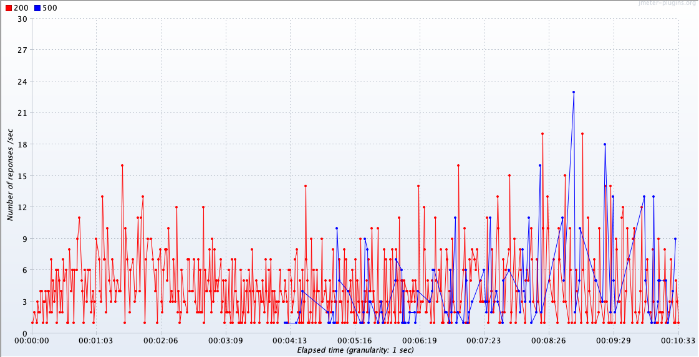

Distributed banking application, composed by REST APIs for account/transaction management and reporting. A React application is also available to operate the APIs by providing features like account/transaction creation, list of accounts, balances and list of acccount transactions.
# Pre-requisites

You must have the following tools installed in your system in order to run the application:

  - JDK 15
  - Node
  - Docker

# Installation

**Services (PostgreSQL Database, Redis Cache, RabbitMQ)**

Open a new terminal window and run the follwing commands:

```sh
$ cd scripts
$ docker-compose up -V
```
`Once all the three service containers are up and running, please take a note of the generated Customer ID in the PostgreSQL's initialization logs. You'll need it to create new accounts using the API or the Web App. You should see something like:`

> db_1        |              customer_id              
db_1        | --------------------------------------
db_1        |  **0d8cf7fa-098d-470c-a09a-bbbb3927436c**
db_1        | (1 row)


**Reports Web Application**

Open a new terminal window and run the follwing commands:

```sh
$ cd applications/reports-web
$ npm install
$ npm start
```
The app must be opened automatically in your browser. If it doesn't, then just open your browser and go to http://localhost:3000

**Accounts API**

Open a new terminal window and run the follwing commands:

```sh
$ cd appplications/account
$ JAVA_HOME=<YourJDK15HomePath> ./gradlew :applications:account:bootRun
```
The API should be accessible at http://localhost:8080/accounts

**Reports API**

Open a new terminal window and run the follwing commands:

```sh
$ cd appplications/reports
$ JAVA_HOME=<YourJDK15HomePath> ./gradlew :applications:reports:bootRun
```
The API should be accessible at http://localhost:8082/reports/accounts

# Architectural Considerations

* As a database mirroring solution, it was opted for using Redis as a persistence layer given its flexibility and speed to manipulate the data.


# Performance Benchmark



The stress test was set up to run for 10 minutes simulating 150 virtual users (threads) with JMeter, gradually increasing the users from 0 until 150 after 5 minutes of execution. During the first 5 minutes, where the virtual users count was approximately up to 80%, the Account API demonstrated an ability of handling between 6 and 9 transactions per second (distributed between write and read operations). At the mark of 5 minutes,  upon the activation of the 150 virtual users, the service started demonstrating the first signs of overload. Therefore, in summary, in the local environment machine seems to be able to handle up to 120 virtual users with a 6~9 TPS average.

Some bottlenecks could also be observed in the database container, where the pool of connections reached its limit, making some transactions time out. To tweak this up, adding an extra database instance could help, or increasing the pool of connections in the applications.

# Scaling

To scale up the applications horizontally, some points need to be observed:

* A Service Discovery system should be included in the architecture, so multiple app containers can be utilised
* An extra database container
* Increase the pool of database connections
* Environment variables injection (database credentials, port configuration, etc)
